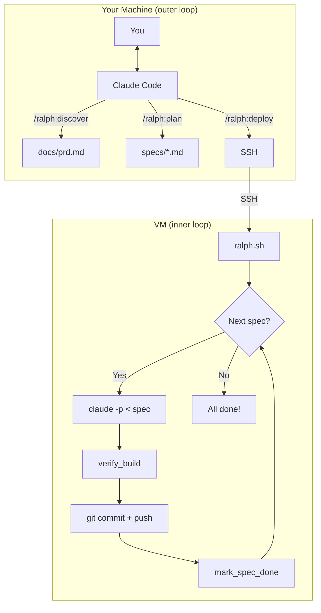

# Ralph Architecture

## Overview



## Core Loop (ralph.sh ~150 lines)

```bash
while true; do
    # 1. Find next incomplete spec
    spec=$(next_incomplete_spec)
    [ -z "$spec" ] && break  # All done!

    # 2. Run Claude on spec
    claude -p --dangerously-skip-permissions < "$spec"

    # 3. Verify build works
    verify_build || continue  # retry if fail

    # 4. Commit + mark done
    git commit && mark_spec_done "$spec"
done
```

## Memory Model (Ryan Carson)

| Type | File | Purpose |
|------|------|---------|
| Short-term | Spec itself | What Claude should do NOW |
| Medium-term | Checksums | Which specs are done |
| Long-term | Git commits | All code built |

**Fresh context per iteration** = Each spec starts with empty Claude session.

## Outer vs Inner Loop

| | Outer (local) | Inner (VM) |
|---|--------------|------------|
| Who controls | YOU | ralph.sh |
| Claude mode | Interactive | `--dangerously-skip-permissions` |
| Purpose | Plan | Build |
| Commands | /ralph:* | None |

## File Structure

```
.ralph/
├── scripts/
│   ├── ralph.sh          # Clean loop (~150 lines)
│   └── ralph-full.sh     # Full mode (--full flag)
│
├── lib/
│   ├── spec-utils.sh     # next_spec, mark_done, checksums
│   ├── verify.sh         # verify_build (with selfheal)
│   ├── selfheal.sh       # Auto-fix missing deps
│   ├── notify.sh         # ntfy + epic tracking
│   ├── git-utils.sh      # commit, push, safety checks
│   └── rate-limit.sh     # Handle rate limits
│
└── templates/stacks/
    └── react-supabase/
        └── scripts/
            ├── requirements.sh  # Check VM deps
            ├── verify.sh        # Stack-specific verify
            └── setup.sh         # Init stack
```

## References

- [snarktank/ralph](https://github.com/snarktank/ralph) - Ryan Carson
- [claude-ralph](https://github.com/RobinOppenstam/claude-ralph) - Robin Oppenstam
- [how-to-build-a-coding-agent](https://github.com/ghuntley/how-to-build-a-coding-agent) - Geoffrey Huntley
